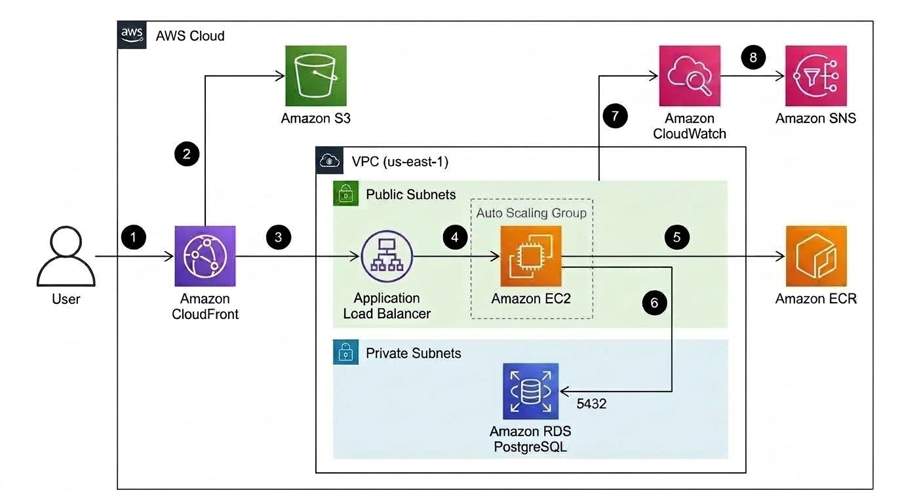
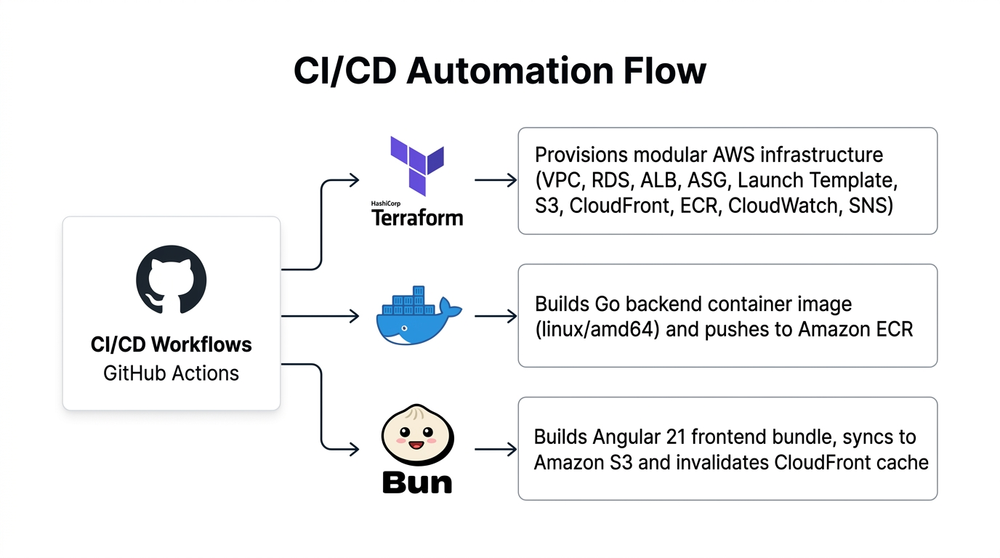

# APSchool

<p align="center">
  
  
  
  
</p>

[English](README.md) | [Español](README.es.md)

Una plataforma web interactiva diseñada para que estudiantes de ingeniería y ciencias de la computación (ESPOL) dominen la programación en Python mediante retos algorítmicos prácticos, con ejecución de código directa en el navegador mediante Pyodide (WebAssembly).

---

## El Problema

Aprender a programar en cursos introductorios universitarios presenta retos significativos: configuraciones locales complejas para principiantes, falta de retroalimentación inmediata sobre casos de prueba, fricción cognitiva al alternar entre editores de código y diapositivas teóricas, y el alto costo financiero y operativo de mantener servidores con entornos aislados de ejecución de código para cientos de estudiantes concurrentes.

---

## La Solución

Este proyecto proporciona una plataforma de aprendizaje moderna y estructurada según el plan de estudios universitario, eliminando riesgos de seguridad y costos de cómputo en el backend:

- **Ejecución de código en el navegador**: Utiliza **Pyodide** (Python compilado en WebAssembly) para ejecutar y evaluar las soluciones de los estudiantes directamente en el navegador web, logrando validación instantánea, costo cero de cómputo en la nube por ejecución e inmunidad ante código malicioso en el servidor.
- **Contenido organizado en retos**: Plan de estudio estructurado en unidades progresivas con problemas algorítmicos, plantillas iniciales y pruebas unitarias que evalúan casos de prueba en tiempo real.
- **Editor de código integrado**: Implementado con **Monaco Editor** (el motor de VS Code), ofreciendo resaltado de sintaxis, autocompletado inteligente y atajos de teclado estándar.
- **Seguimiento de progreso y autenticación**: Inicio de sesión seguro con **GitHub OAuth** y sesiones JWT, registrando los retos resueltos, intentos y métricas de avance por estudiante.

---

## Capturas de Pantalla

| Inicio (sin autenticar) | Inicio (con sesión iniciada) |
|---|---|
|  |  |

| Lista de Retos | Reto resuelto con éxito |
|---|---|
|  |  |

| Autenticación con GitHub |
|---|
|  |

---

## Arquitectura de la Solución

La plataforma está desplegada en AWS mediante una arquitectura en la nube escalable, segura y optimizada para costos, aprovisionada completamente como código con Terraform. Combina ejecución en el navegador mediante WebAssembly con un backend en Go empaquetado en contenedores Docker, administrado por un Auto Scaling Group detrás de un Application Load Balancer y distribuido globalmente con Amazon CloudFront.



### Componentes de la Arquitectura
- **Frontend SPA**: Interfaz de usuario Single Page Application construida en **Angular 21**, alojada en **Amazon S3** y distribuida globalmente con **Amazon CloudFront** mediante Origin Access Control (OAC). Los archivos estáticos se almacenan en caché en ubicaciones de borde, y la ejecución del código Python se realiza localmente en el navegador mediante WebAssembly.
- **Reverse Proxy Unificado**: **Amazon CloudFront** centraliza el acceso en un único dominio HTTPS, enrutando el contenido estático (`/*`) a S3 y las peticiones a la API (`/api/*`) directamente al Application Load Balancer, eliminando la necesidad de configurar CORS.
- **API REST Contenerizada**: Backend de alto rendimiento desarrollado en **Go 1.25** y empaquetado en contenedores **Docker**. Las imágenes se almacenan en **Amazon ECR** con políticas automáticas de ciclo de vida. La API se ejecuta en instancias **EC2** (Amazon Linux 2023) administradas por un **Auto Scaling Group (ASG)** en subredes públicas, recibiendo tráfico mediante un **Application Load Balancer (ALB)**.
- **Capa de Base de Datos**: Base de datos relacional gestionada **Amazon RDS PostgreSQL 16** en subredes privadas aisladas a través de múltiples zonas de disponibilidad. El acceso en el puerto 5432 está restringido exclusivamente al grupo de seguridad del backend.
- **Infraestructura como Código**: Infraestructura aprovisionada de forma modular y reproducible con **Terraform 1.16+**, utilizando backend remoto en **Amazon S3** con control de concurrencia nativo por lockfile.
- **Monitoreo y Observabilidad**: Alarmas en **Amazon CloudWatch** para supervisar instancias no saludables en el ALB, consumo de CPU en el ASG y tasa de errores 5XX, con notificaciones automáticas mediante **Amazon SNS**.

### Flujo de Automatización CI/CD

El proceso de entrega continua está totalmente automatizado mediante GitHub Actions, coordinando cambios de infraestructura, empaquetado de contenedores y despliegue del frontend:



- **Automatización con Terraform**: Aprovisiona y administra todos los recursos de AWS de forma ordenada e idempotente.
- **Compilación de Contenedores y Registro**: Compila el binario del backend Go en una imagen Docker optimizada para `linux/amd64` y la publica en Amazon ECR.
- **Compilación Frontend y Despliegue en Edge**: Compila la aplicación Angular 21 utilizando Bun, sincroniza los archivos en Amazon S3 y dispara la invalidación automática de caché en CloudFront.

---

## Estructura del Repositorio

```
apschool/
├── .github/workflows/    # Workflows de CI y despliegue/destrucción con GitHub Actions
├── diagrams/             # Diagramas oficiales de arquitectura AWS y CI/CD
├── images/               # Capturas de pantalla de la interfaz y recursos gráficos
├── infra/                # Infraestructura como Código modular (Terraform 1.16+)
│   ├── environments/prod # Configuración de producción y estado remoto del backend
│   └── modules/          # VPC, RDS, ALB, Compute, ECR, Frontend y Monitoreo
├── server/               # API REST en Go 1.25, migraciones Goose y semillas de datos
└── web/                  # SPA en Angular 21, Monaco Editor y runtime Pyodide WebAssembly
```

---

## Requisitos Previos
- Bun (para dependencias y compilación del frontend)
- Go 1.25+ (para el servicio backend)
- Docker (para compilación de contenedores y base de datos local)
- Terraform 1.16+ (para administración de la infraestructura en AWS)

---

## Ejecución Local

1. **Base de Datos y Backend**:
   ```bash
   cd server
   docker compose up -d
   go run ./cmd/api
   ```

2. **Carga de Datos Iniciales (Seed)**:
   ```bash
   cd server
   go run ./cmd/seed
   ```

3. **Cliente Frontend**:
   ```bash
   cd web
   bun install
   bun run start
   ```

4. Abrir `http://localhost:4200` en el navegador.
