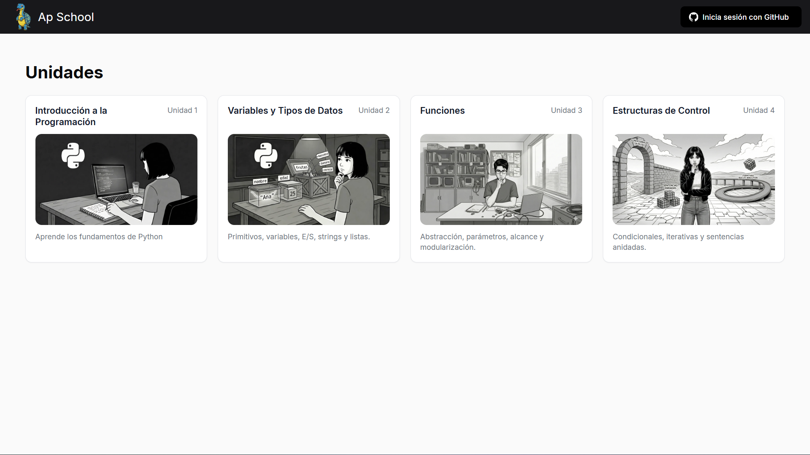
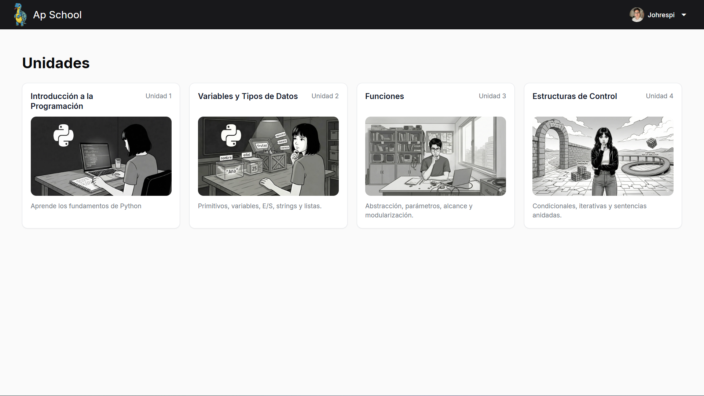
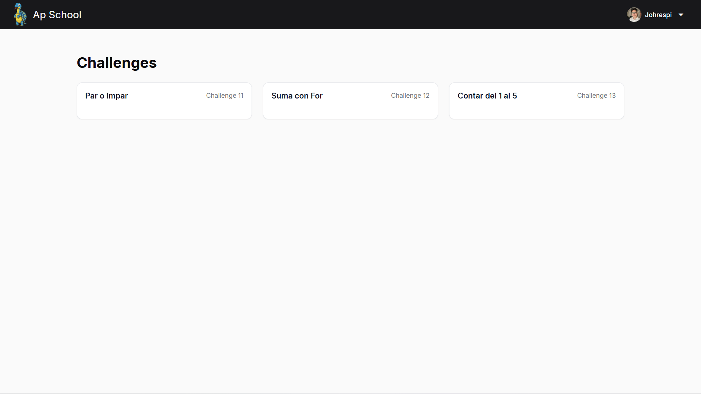
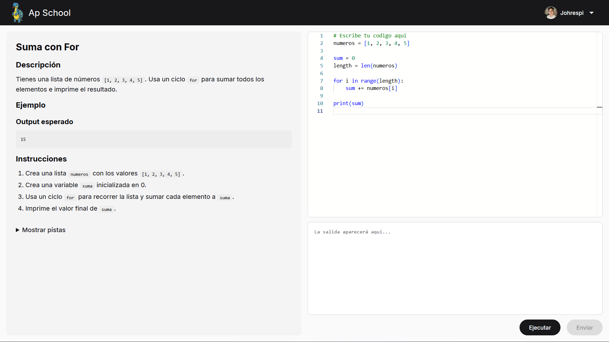
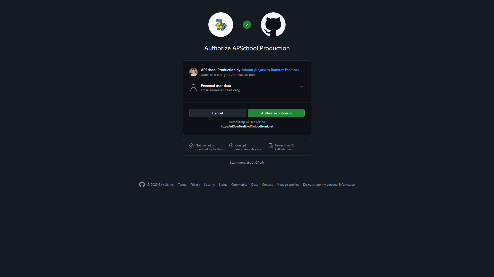

# APSchool

Plataforma web para estudiantes de ESPOL para practicar Python con challenges interactivos. El codigo se ejecuta directamente en el navegador usando Pyodide (Python compilado a WebAssembly).

**Demo:** https://d3ow6eel2jvdfj.cloudfront.net

## Screenshots

| Home (sin login) | Home (con login) |
|------------------|------------------|
|  |  |

| Challenges | Challenge resuelto |
|------------|-------------------|
|  |  |

| GitHub OAuth |
|--------------|
|  |

## Arquitectura

```
+--------------------------------------------------+
|                  BROWSER                         |
|  +------------+  +----------+  +---------------+ |
|  |  Angular   |->|  Pyodide |<-| Monaco Editor | |
|  +------------+  +----------+  +---------------+ |
|        |              |                          |
|        |         Ejecuta Python                  |
|        |         Valida tests                    |
|        |              |                          |
|        v              v                          |
|   Si pasa tests -> POST /api/submissions         |
+--------------------------------------------------+
                       |
                       v
+--------------------------------------------------+
|                  AWS                             |
|  +-------------+  +-----+  +------------------+  |
|  | CloudFront  |->| EC2 |->| RDS (PostgreSQL) |  |
|  | + S3        |  | Go  |  |                  |  |
|  +-------------+  +-----+  +------------------+  |
+--------------------------------------------------+
```

## Stack

### Frontend
- Angular 21 (Standalone Components, Signals)
- Monaco Editor
- Pyodide (WebAssembly)
- Angular Material

### Backend
- Go 1.21+
- Chi Router
- PostgreSQL
- GitHub OAuth + JWT

### Infraestructura (AWS)
- CloudFront + S3 (frontend)
- EC2 + Docker (backend)
- RDS PostgreSQL (base de datos)

## Features

- Ejecucion de Python en el navegador (sin servidor)
- Login con GitHub OAuth
- 12 challenges organizados en 4 unidades
- Editor de codigo con syntax highlighting
- Sistema de pistas para cada challenge

## Por que Pyodide?

| Aspecto | Beneficio |
|---------|-----------|
| Costo | $0 - usa la CPU del usuario |
| Seguridad | Codigo malicioso solo afecta al usuario que lo escribe |
| Latencia | Instantanea (sin round-trip al servidor) |
| Escalabilidad | 1 o 100,000 usuarios = mismo costo |

## Desarrollo Local

Ver instrucciones detalladas en:
- [Frontend (Angular)](web/README.md)
- [Backend (Go)](server/README.md)

## Autor

Johann Ramirez - johrespi@espol.edu.ec
